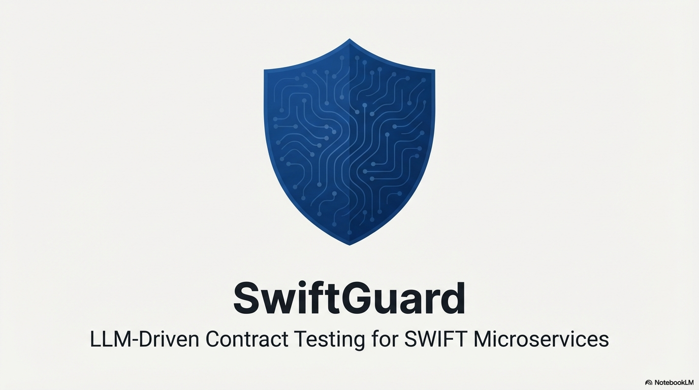
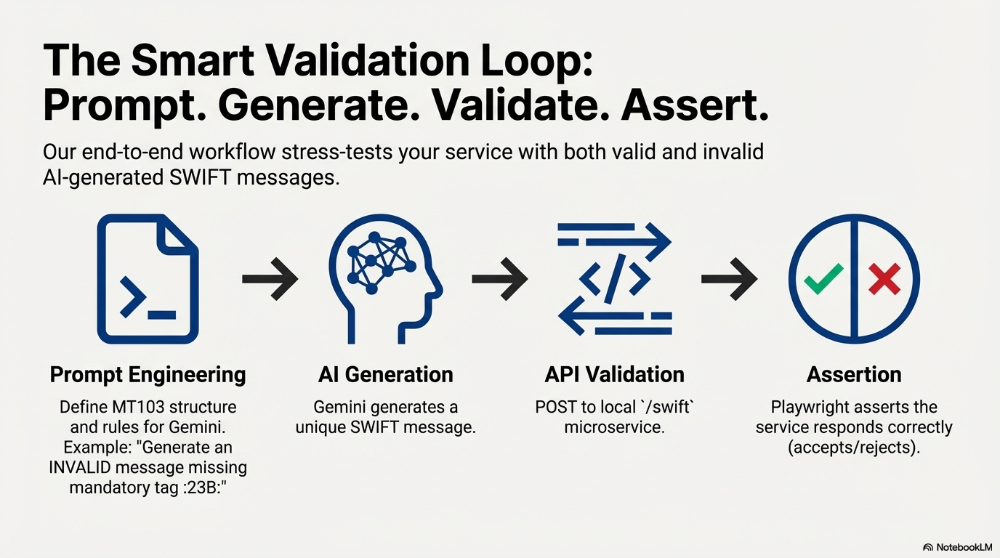

# SwiftGuard


**LLM-Driven Contract Testing for SWIFT Microservices**

## Overview

SwiftGuard is a lightweight, dependency-minimal contract testing framework designed to validate microservices that handle SWIFT (Society for Worldwide Interbank Financial Telecommunication) messages. In traditional financial software testing, generating high-quality, diverse, and edge-case-rich test data is a manual and error-prone process. SwiftGuard automates this using Generative AI.

**Why is this important?**
*   **Financial Compliance**: SWIFT messages (like MT103) have strict formats and validation rules. Errors can lead to failed transactions and regulatory fines.
*   **Edge Case Discovery**: Human testers often test "happy paths." LLMs can generate thousands of subtle variations (malformed tags, boundary values, incorrect sequences) to robustly stress-test the parser.
*   **Zero-Dependency Architecture**: The core service runs on native Node.js (no Express/Fastify overhead), making it easy to deploy in restricted financial environments.

## How It Works: LLM-Driven Data Generation

SwiftGuard connects to **Generative AI Providers** (Google Gemini, DeepSeek, Groq, Puter) to dynamically generate test data. Instead of relying on static `.json` or `.xml` stovepipes, we use the LLM as an intelligent fuzzer.

### The Workflow


1.  **Prompt Engineering**: We feed the AI a strict prompt defining the SWIFT MT103 structure (e.g., Mandatory tags `:20:`, `:32A:`, `:50K:`).
2.  **Dynamic Generation**: 
    *   **Valid Scenario**: We ask the AI to "Generate a valid MT103 message with strict SWIFT tags."
    *   **Invalid Scenario**: We ask the AI to "Generate an INVALID message missing mandatory tag :23B:."
3.  **Validation**:
    *   The generated message is sent to our local microservice (`POST /swift`).
    *   The service parses the message and validates it against a strict **JSON Schema**.
    *   The **Playwright** test suite asserts that the service correctly accepts valid messages and rejects invalid ones.

This approach ensures that your microservice is battle-tested against non-deterministic, AI-generated inputs, simulating real-world messiness better than static mock data.

## Features

-   **Multi-LLM Support**: Switch between **Gemini**, **DeepSeek**, **Groq**, and **Puter.ai** based on your needs or quota.
-   **AI-Powered Fuzzing**: Generates endless unique SWIFT message variations using state-of-the-art models.
-   **Strict Schema Validation**: Uses `Ajv` (Another JSON Schema Validator) to enforce business rules.
-   **HTML-Only Dashboard**: A lightweight, glassmorphism-styled UI to visualize processed messages in real-time.
-   **End-to-End Testing**: Integrated `Playwright` tests verify the entire flow (Generation -> API -> UI).

## Prerequisites

-   Node.js v18+
-   An API Key for your chosen LLM Provider (Google Gemini, DeepSeek, or Groq).

## Installation

1.  **Clone the repository**:
    ```bash
    git clone https://github.com/your-repo/swiftguard.git
    cd swiftguard
    ```

2.  **Install dependencies**:
    ```bash
    npm install
    ```

3.  **Configure Environment**:
    Create a `.env` file in the root directory and add the key for your active provider:
    ```env
    # Option 1: Google Gemini
    GEMINI_API_KEY=your_gemini_key

    # Option 2: DeepSeek AI
    DEEPSEEK_API_KEY=your_deepseek_key

    # Option 3: Groq AI
    GROQ_API_KEY=your_groq_key
    ```

4.  **Select LLM Provider**:
    Open `llm/swiftGenerator.js` and uncomment the provider you wish to use:
    ```javascript
    // const generator = require('./geminiGenerator'); 
    // const generator = require('./puterGenerator');
    // const generator = require('./deepseekGenerator');
    const generator = require('./groqGenerator'); // Active
    ```

## Usage

### 1. Run the Tests (Automated)
This will spin up the local service, generate data via Gemini, and verify the results.
```bash
npx playwright test
```

### 2. Manual Testing (Dashboard)
Start the service manually:
```bash
node service/swiftService.js
```
Open your browser to: [http://localhost:1934](http://localhost:1934)


## Project Structure

*   `llm/`: Logic for interacting with Gemini API.
*   `parser/`: Custom regex-based parser for raw SWIFT messages.
*   `contracts/`: JSON Schema definitions for validation.
*   `service/`: Native Node.js HTTP server.
*   `tests/`: Playwright E2E test suite.
*   `ui/`: Frontend dashboard.

---
*Built with ❤️ using Node.js, Playwright, and Google Gemini.*

----
Contributors

Mukul Dev Mahato - QA Automation Engineer | [LinkedIn](https://www.linkedin.com/in/mukul-dev-a02108198/)